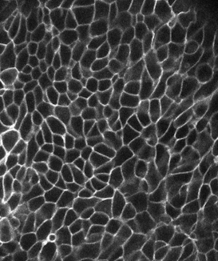
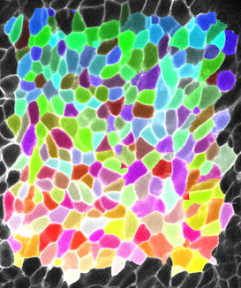
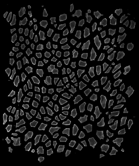

# tissue_exploder

Creates a nice "exploded" visualization of segmented cells in a tissue.

| **Original image**  | **Original with cell labels** | **Exploded visualization** |
| --- | --- | --- |
|  |  |  |

### Notes

- Can be used with 2D and 3D (+channels) image data

- Works by shifting the centroids of segmented objects apart by a given amount and then reconstructing the segmented objects around their shifted centroids

- Keep in mind that output images may be substantially larger than input images, especially for `scale_factor > 2`

- See `nbs/examples.ipynb` for some basic usage examples (requires jupyter, matplotlib)

- Requires python 3, numpy, scikit-image

- Installation:
    - Clone this repo
    - Open CLI and navigate to repo folder
    - Activate your environment of choice
    - Run `pip install -e .`